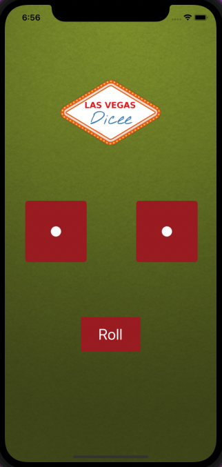

# Rolling-Dice
This is a Beautiful dice application that i have build and design using Xcode and Swift. The "Rolling Dice" application also have Roll Button which have 
functionality (written in Swift) to change the dice faces randomly.

## What i have learnt while building "Rolling Dice" application?

--> How to link design with code via IBActions and IBOutlets.

--> I have learnt to detect user interaction through UIButtons.

--> How to use Swift variables, constants and collection types.

--> I have learned about randomisation in swift and range operators.

--> I have learned to use Image Literals in code.

--> I have learned to use Swift Playgrounds.

--> I have learned about the data type system and the primitive data types such as Strings, Ints and Doubles.

## Screenshots

